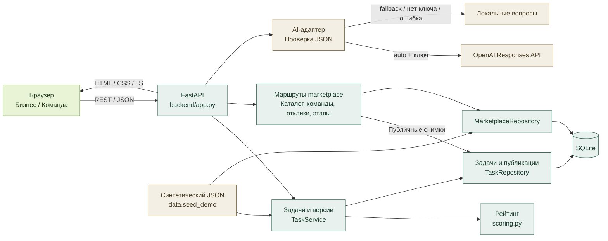

# импульс.

> От короткой идеи бизнеса — к понятному проекту для студенческой команды.

**импульс.** помогает бизнесу подготовить задачу с помощью AI, оценить полноту описания и выбрать исполнителей. Команды находят опубликованные проекты, предлагают решения и получают баллы за подтверждённый прогресс.

`HackAlem · MVP` · `FastAPI + SQLite` · `OpenAI Responses` · `Docker`

| Для бизнеса | Для команды | Для жюри |
|---|---|---|
| Уточнить задачу и увидеть, чего не хватает | Найти проект и предложить план работы | Повторить весь путь от описания до подтверждённого этапа |

Серверные маршруты marketplace и пять экранов подключены к общей навигации. Экраны используют общий HTTP-клиент и также доступны в автономной странице. Шаги 1.5–1.6 завершены: бизнес-сценарий, навигация и marketplace проверены в Edge 23.09.2026; результаты и границы проверки — в [отчёте браузерной приёмки](frontend/business/ACCEPTANCE.md).

**Быстрый маршрут:** [запустить проект](#установка-и-запуск) → [повторить сценарий](#повторяемая-проверка-для-жюри) → [посмотреть тесты и отчёты](#проверки-проекта).

## Оглавление

- [Проблема и аудитория](#проблема-и-аудитория)
- [Что реализовано](#что-реализовано)
- [Сценарий для демонстрации](#сценарий-для-демонстрации)
- [Технологии](#технологии)
- [Архитектура и структура](#архитектура-и-структура)
- [Установка и запуск](#установка-и-запуск)
- [Повторяемая проверка для жюри](#повторяемая-проверка-для-жюри)
- [Данные и интеграции](#данные-и-интеграции)
- [Проверки проекта](#проверки-проекта)
- [Ограничения MVP](#ограничения-mvp)
- [Развёрнутая версия](#развёрнутая-версия)

## Проблема и аудитория

Проект посвящён подготовке бизнес-задач для студенческих команд. Его исходный сценарий — неполное описание, в котором нужно уточнить контекст, пользователей, данные, ограничения и критерии успеха. Цель и требования к этому сценарию зафиксированы в [плане разработки](DEVELOPMENT_PLAN.md#1-основа-и-цель).

«импульс.» помогает пройти этот путь последовательно: представитель бизнеса описывает потребность и уточняет карточку, система рассчитывает её готовность, команда находит опубликованную задачу и отправляет предложение, а заказчик выбирает исполнителей и отмечает подтверждённый этап.

**Кому предназначен прототип:**

- представителям бизнеса, которым нужно сформулировать прикладную задачу;
- студенческим командам, ищущим проекты с понятными ожиданиями;
- жюри и организаторам, которым нужно увидеть путь от описания до результата в одном интерфейсе.

## Что реализовано

| Возможность | Что получает пользователь |
|---|---|
| AI-помощник | Анализ описания, минимум три уточняющих вопроса и предложения по заполнению карточки |
| Редактируемая карточка | 12 полей с отдельными отметками «Подтверждаю»; все предложения AI можно изменить |
| Рейтинг готовности | Балл 0–100, расшифровка весов, уровень готовности и список недостающих сведений |
| Черновик и публикация | Сохранение рабочей версии и отдельный публичный снимок подтверждённых значений |
| Каталог | Сортировка по рейтингу, фильтры темы и готовности, выделение приоритетных задач |
| Профили команд | Название, интересы, навыки, технологии и накопленные баллы за этапы |
| Отклики | Идея, план, срок и необязательная HTTP(S)-ссылка на прототип |
| Решение бизнеса | Ручной выбор одной или нескольких команд, отказ либо отсутствие решения |
| Подтверждённые этапы | Сохранение результата и отдельное подтверждение с однократными +10 команде |
| Сохранение и конфликты | SQLite, восстановление данных после перезапуска и обнаружение устаревшей версии при редактировании |
| 3.4 — демоданные | Готово: 5 описаний/карточек, 5 команд, 5 откликов; баллы 0/40/70/90/100; отдельная демо-БД |
| 3.5 — тесты marketplace | Готово: фикстура исправлена, 5/5 серверных тестов |
| 3.6 — интеграция и браузер | Общая оболочка подключена; сценарии каталога, откликов, выбора команд и этапов пройдены в браузерной приёмке участника 1 от 23.09.2026 |
| 3.7 — README | Готово: актуальные запуск, архитектура, контракты и проверки |
| 3.8 — защита | Материалы готовы; общая репетиция ещё не проведена |

### Как устроен рейтинг

Баллы начисляются сервером за **непустые подтверждённые поля**. Каждая группа даёт полный вес, если выполнены все её условия; иначе — 0. Формула реализована в [backend/scoring.py](backend/scoring.py).

| Группа | Условие | Баллы |
|---|---|---:|
| Контекст и потребность | Оба поля заполнены и подтверждены | 20 |
| Данные | Описаны доступные материалы или источники | 20 |
| Ожидаемый результат | Указано, что команда должна передать бизнесу | 15 |
| Критерии успеха | Описано, как проверить результат | 15 |
| Ограничения | Указаны границы задачи | 10 |
| Пользователи | Описано, для кого создаётся решение | 10 |
| Связь с бизнесом | Подтверждены контакт, формат взаимодействия и обратная связь | 10 |
| **Всего** | **Сумма семи выполненных групп** | **100** |

**Тема и название не добавляют баллов.** Название нужно подтвердить для публичного заголовка, тему — для её отображения и фильтрации в каталоге.

| Баллы | Уровень | Код API |
|---|---|---|
| 0–39 | Черновик | `draft` |
| 40–69 | Рабочая | `working` |
| 70–89 | Готовая | `ready` |
| 90–100 | Приоритетная | `priority` |

Даже опубликованная задача с 0 баллами видна в каталоге и принимает отклики. Уровень «Черновик» характеризует полноту описания; отсутствие публикации — отдельное состояние.

> **Две независимые оценки:** рейтинг задачи показывает готовность её описания. Баллы команды растут на **+10 за каждый этап**, подтверждённый бизнесом после выбора команды. Отклик сам по себе баллов не даёт; повторное подтверждение того же этапа не удваивает начисление.

## Сценарий для демонстрации

**Вход:** короткое описание бизнес-проблемы и ответы на уточнения. **Результат:** опубликованная карточка, предложения команд, ручное решение заказчика и сохранённый подтверждённый этап.

```text
Описание бизнеса → вопросы AI → ответы и редактирование
       → подтверждение → рейтинг → публикация
       → отклик команды → выбор бизнеса → этап → +10 команде
```

1. **Бизнес описывает проблему.** Например: «Хотим сократить очереди в кафе в обед».
2. **AI помогает уточнить задачу.** Возвращает вопросы и предложения по полям; неизвестные сведения должны оставаться пустыми. В резервном режиме вопросы формируются локально.
3. **Человек проверяет содержание.** Редактирует карточку и подтверждает выбранные поля. Сервер пересчитывает полноту описания.
4. **Бизнес публикует задачу.** В каталог попадает снимок подтверждённых значений; последующие правки черновика не меняют его до новой публикации.
5. **Команда предлагает решение.** Находит задачу, выбирает профиль и отправляет идею, план и срок.
6. **Бизнес принимает решение.** Выбирает одну или несколько команд либо отклоняет предложения. Автоматического назначения нет.
7. **Прогресс подтверждается отдельно.** Создаётся этап с описанием результата; после подтверждения выбранная команда получает +10 один раз за этот этап.

[Ниже — готовые значения и точные кнопки для повторения этого сценария.](#повторяемая-проверка-для-жюри)

## Технологии

| Слой | Технологии | Назначение |
|---|---|---|
| Интерфейс | HTML5, CSS, JavaScript ES modules | Оболочка, редактор задачи и marketplace; отдельная сборка frontend не требуется |
| Среда сервера | Python 3.10+; в Docker — Python 3.13 slim | Выполнение серверного приложения |
| HTTP API | FastAPI **0.115.0**, Uvicorn **0.30.6** | REST API, Swagger UI, раздача статических файлов |
| Валидация | Pydantic **2.13.5** | Проверка типов, полей и ограничений запросов |
| Данные | SQLite, стандартный модуль `sqlite3` | Задачи, публикации, команды, отклики и этапы |
| AI | OpenAI Platform, **Responses API**, модель **`gpt-4.1-mini`** по умолчанию | Уточнение бизнес-задачи; модель меняется через `OPENAI_MODEL` |
| HTTP к AI | Стандартные `urllib.request` и `json`, JSON Schema | Серверный запрос к OpenAI и проверка структурированного ответа; отдельный OpenAI SDK не используется |
| Конфигурация | `python-dotenv` **1.2.3**, переменные окружения | Локальная конфигурация и ключ API |
| Запуск | Dockerfile, Docker Compose, Windows BAT | Повторяемая сборка и запуск |
| Проверки | Python `unittest`, Node.js `node:test` | Core, HTTP/repository и модульные JS-регрессии |

Версии рабочих Python-зависимостей зафиксированы в [backend/requirements.txt](backend/requirements.txt). Node.js нужен только для JS-тестов; React, npm-сборка и отдельный сервер frontend для MVP не требуются.

## Архитектура и структура

В стандартной конфигурации интерфейс и API обслуживает один сервис FastAPI. Он отдаёт статические файлы и принимает запросы `/api/...`; сервис задач и marketplace используют общий SQLite-файл.



### Правила взаимодействия

- **Подтверждение и публикация — отдельные действия.** В опубликованном снимке неподтверждённые значения пустые. Каталог читает снимки через `TaskRepository.list_published_tasks()`.
- **Редактирование снимает подтверждение изменённых полей.** Рабочий рейтинг пересчитывается, а старая публикация сохраняется до следующей публикации.
- **Запись требует актуальную версию.** `PATCH`, подтверждение и публикация получают `expectedRevision`; при конфликте сервер возвращает `409` и текущую задачу. Интерфейс сохраняет ввод и предлагает выбрать версию.
- **Этапы сохраняются отдельно от начисления.** SQLite-транзакция проверяет выбор команды и факт предыдущего подтверждения, чтобы повторный запрос не добавлял баллы.

| Путь | Содержимое |
|---|---|
| [frontend/index.html](frontend/index.html), [frontend/styles.css](frontend/styles.css) | Общая оболочка, стили и навигация |
| [frontend/app.js](frontend/app.js) | Текущий сценарий бизнеса, редактор, рейтинг, переключение ролей и подключение экранов |
| `frontend/business/` | Выделенная зона участника 1; сейчас содержит правила, код сценария находится в `app.js` |
| [frontend/shared/api.js](frontend/shared/api.js) | Общий HTTP-клиент и обработка ошибок API |
| `frontend/marketplace/` | Каталог, профили, отклики, этапы, отдельная демо-страница и JS-тесты |
| [backend/app.py](backend/app.py) | Сборка FastAPI, маршруты ядра, подключение marketplace и статики |
| `backend/tasks.py`, `backend/scoring.py`, `backend/db.py`, `backend/schemas.py` | Жизненный цикл задач, рейтинг, SQLite и схемы данных |
| [backend/ai.py](backend/ai.py), [backend/config.py](backend/config.py) | AI-адаптер, резервный режим и настройки |
| `backend/marketplace/` | Собственные маршруты, схемы и репозиторий команд, откликов и этапов |
| `backend/tests/core/`, `backend/tests/marketplace/` | Серверные тесты |
| [data/marketplace-seed.json](data/marketplace-seed.json), [data/seed_demo.py](data/seed_demo.py) | Демоданные и загрузчик через сервис задач и marketplace-репозиторий |
| [Dockerfile](Dockerfile), [compose.yaml](compose.yaml), [start.bat](start.bat) | Способы запуска |
| `backend/runtime/` | Локальная SQLite и временные файлы; исключены из Git |
| [DEVELOPMENT_PLAN.md](DEVELOPMENT_PLAN.md), [docs/PARTICIPANT_2.md](docs/PARTICIPANT_2.md) | Разделение работ, контракты и подробный отчёт проверок |

## Установка и запуск

### Получить исходники

Скачайте архив репозитория и распакуйте его либо используйте Git:

```bash
git clone https://github.com/BAITC-Hacks/hack-4d63cc53-team.git
cd hack-4d63cc53-team
```

Все дальнейшие команды выполняются **из корня проекта**. Ниже команды для PowerShell. Выберите один способ запуска: Docker, BAT или вручную. Для Docker локальный Python не нужен; для двух остальных вариантов нужен Python 3.10+.

### Вариант 1. Docker Compose

**Нужно:** установленный и запущенный Docker Desktop с Linux-контейнерами, свободный порт 8000 и интернет при первой сборке.

1. Создайте файл настроек, если его ещё нет:

   ```powershell
   if (-not (Test-Path .env)) { Copy-Item .env.example .env }
   ```

2. Для повторяемого демо добавьте или установите в `.env` строку `AI_MODE=fallback`. Существующий ключ сохраняется, но в этом режиме не используется. Для настоящего OpenAI см. [настройки интеграции](#данные-и-интеграции).

3. Соберите и запустите приложение:

   ```powershell
   docker compose up -d --build
   docker compose ps
   ```

4. Откройте **[http://127.0.0.1:8000/](http://127.0.0.1:8000/)**. Статус контейнера после запуска должен стать `healthy`.

| Действие | Команда |
|---|---|
| Повторный запуск | `docker compose up -d` |
| Обновить после изменения кода | `docker compose up -d --build` |
| Посмотреть логи | `docker compose logs -f app` |
| Остановить приложение | `docker compose stop` |

Пакеты устанавливаются при сборке в отдельный слой перед копированием кода. При неизменных зависимостях, базовом образе и сохранённом кэше Docker использует этот слой повторно. При запуске контейнера `pip install` не выполняется.

SQLite находится в томе `app_runtime` по пути `/app/backend/runtime/app.sqlite3`. Он сохраняется после обычной остановки, пересборки и пересоздания контейнера. Это отдельная база от локальной `backend/runtime/app.sqlite3`; данные автоматически между ними не копируются. Команда `docker compose down -v` удаляет том вместе с данными — для обычной остановки используйте команду из таблицы.

### Вариант 2. Windows — двойной щелчок

Запустите [start.bat](start.bat) двойным щелчком либо из PowerShell:

```powershell
.\start.bat
```

Скрипт находит установленный Python 3.10+, создаёт отсутствующую `.venv`, копирует `.env.example` только при отсутствии `.env`, устанавливает зависимости и запускает сервер. Браузер открывается после успешной проверки `/api/health`; существующий ключ не перезаписывается. При ошибке окно остаётся открытым с пояснением. Для остановки нажмите `Ctrl+C`.

### Вариант 3. Python вручную

```powershell
if (-not (Test-Path .venv\Scripts\python.exe)) { py -3 -m venv .venv }
if (-not (Test-Path .env)) { Copy-Item .env.example .env }
.\.venv\Scripts\python.exe -m pip install -r backend/requirements.txt
.\.venv\Scripts\python.exe -m uvicorn backend.app:app --host 127.0.0.1 --port 8000
```

Откройте основной адрес вручную; остановка — `Ctrl+C`. Вместо последней команды можно выполнить `.\.venv\Scripts\python.exe -m backend.launch` для автоматического открытия браузера. Для разработки Uvicorn поддерживает `--reload`.

### Адреса после запуска

| Адрес | Назначение |
|---|---|
| [Основной интерфейс](http://127.0.0.1:8000/) | Весь пользовательский сценарий |
| [Отдельное демо marketplace](http://127.0.0.1:8000/marketplace/demo.html) | Каталог, команды, отклики и этапы вне основной оболочки |
| [Проверка сервера](http://127.0.0.1:8000/api/health) | JSON `{"status":"ok"}` |
| [Swagger UI](http://127.0.0.1:8000/docs) | Интерактивная документация API |
| [OpenAPI JSON](http://127.0.0.1:8000/openapi.json) | Машиночитаемая схема API |

### Если запуск не получается

| Симптом | Что проверить |
|---|---|
| Порт 8000 занят | Остановить предыдущий BAT/Uvicorn или Docker-контейнер; использовать один способ запуска |
| Docker не соединяется с движком | Запустить Docker Desktop и дождаться готовности Linux engine |
| Вместо OpenAI показан резервный режим | Проверить `AI_MODE`, наличие ключа в `.env` именно этого сервера и причину в интерфейсе; после изменения настроек перезапустить сервер |
| Нет связи с сервером | Открывать страницу через `http://127.0.0.1:8000/`, а не двойным щелчком по HTML |
| После смены настроек ничего не изменилось | Перезапустить BAT/Uvicorn; для Compose повторить `docker compose up -d` |

## Повторяемая проверка для жюри

### Основной маршрут: одна новая задача от идеи до +10

**Подготовка:** до запуска установите `AI_MODE=fallback` в `.env`, затем запустите проект любым способом выше. Так демонстрация не зависит от ключа или внешнего сервиса; если сервер уже работает, перезапустите его после изменения настройки. Пример использует синтетические сведения. Новую задачу назовём **«Предзаказ кафе — демо»**, новую команду — **«Flow Makers Demo»**. На протяжении всего маршрута открывайте именно эту карточку.

#### 1. Получить вопросы и заполнить карточку

В режиме **«Бизнес»** нажмите **«Создать задачу»**. Введите:

> Хотим сократить очереди в кафе в обед.

Нажмите **«Проанализировать»**. Появятся минимум три уточняющих вопроса и явная отметка резервного режима. Можно ответить: нужно сократить ожидание; пользователи — гости и кассиры; доступны обезличенные времена заказов. Нажмите **«Перейти к карточке»** и заполните поля:

| Поле | Готовое значение для демонстрации |
|---|---|
| Тема | Кафе |
| Название | Предзаказ кафе — демо |
| Контекст | В будни с 12:00 до 14:00 гости долго ждут у кассы |
| Потребность | Сократить время ожидания заказа |
| Пользователи | Гости кафе и кассиры |
| Данные | Обезличенные времена заказа и выдачи за две недели |
| Ограничения | Веб-прототип за две недели, без изменения кассы и интеграции с оплатой |
| Ожидаемый результат | Прототип предзаказа и отчёт о пилоте |
| Критерии успеха | Среднее ожидание на тестовой выборке сократилось на 20% |
| Контакт | Демо-менеджер кафе |
| Формат взаимодействия | Созвон по вторникам на 15 минут |
| Обратная связь | Менеджер проверяет прототип и отвечает в течение двух рабочих дней |

Это **условия демонстрационной задачи**, а не заявленный достигнутый экономический эффект проекта.

#### 2. Показать рост рейтинга и опубликовать

1. Отметьте «Подтверждаю» **только** у темы, названия, контекста, потребности и данных.
2. Нажмите **«Сохранить и пересчитать»**. Ожидаемый рейтинг — **40/100**: контекст/потребность дают 20, данные — ещё 20.
3. Подтвердите остальные заполненные поля и снова нажмите **«Сохранить и пересчитать»**. Ожидаемый рейтинг — **100/100**.
4. Нажмите **«Опубликовать задачу»**. Появится подтверждение публикации; задача доступна в каталоге как приоритетная.

#### 3. Отправить предложение команды

Переключитесь на **«Команда»** → **«Команды»**. Создайте профиль:

| Поле | Значение |
|---|---|
| Название | Flow Makers Demo |
| Интересы | Сервисы для кафе, UX |
| Навыки | JavaScript, исследование пользователей |
| Технологии | HTML, CSS |

Нажмите **«Создать профиль»**, затем **«Каталог проектов»**. Найдите «Предзаказ кафе — демо» (можно использовать тему «кафе» и готовность «Приоритет»), нажмите **«Открыть задачу»**.

В форме отклика **вручную выберите `Flow Makers Demo` в списке команд** — создание профиля не выбирает его автоматически. Заполните:

| Поле | Значение |
|---|---|
| Идея | Экран предварительного заказа обедов для гостей кафе |
| План | Провести интервью, собрать макет и проверить его на пяти гостях |
| Срок | Две недели |
| Прототип | `https://example.com/cafe-prototype` — демонстрационная ссылка, необязательное поле |

Нажмите **«Отправить предложение»**. Отклик сохранится в статусе ожидания решения; баллы команды пока **0**.

#### 4. Выбрать команду и подтвердить этап

1. Переключитесь на **«Бизнес»** → **«Мои задачи»**. У «Предзаказ кафе — демо» нажмите **«Отклики»**.
2. У предложения `Flow Makers Demo` нажмите **«Выбрать»**. Статус станет «Выбрана».
3. В верхнем списке выбранных команд укажите `Flow Makers Demo` и нажмите **«＋ Зафиксировать этап»**.
4. В поле «Что сделано» введите `Подготовлен и показан прототип предзаказа`. В поле «Ссылка или описание результата» — `Демонстрация пяти сценариев заказа на встрече с демо-менеджером`.
5. Нажмите **«Зафиксировать этап»**. Этап сохранится, но баллы ещё не начислены.
6. Нажмите **«Подтвердить и начислить +10»**. Этап станет подтверждённым, а баллы этой команды увеличатся до **10**. Рейтинг задачи останется **100**.
7. Перезагрузите страницу. Снова откройте отклики и этапы, затем профиль команды: выбор, подтверждённый этап и баллы сохраняются. Кнопки повторного подтверждения этого этапа больше нет.

**Результат показа:** жюри видит подготовку задачи, объяснимый рост 40 → 100, публикацию, самостоятельный отклик, решение бизнеса и подтверждённый прогресс команды.

### Дополнительные проверки

| Действие | Ожидаемый результат |
|---|---|
| Изменить поле «Данные» и сохранить черновик | Подтверждение этого поля снимается; рабочий рейтинг становится 80. В каталоге остаётся прежняя публикация до отдельного обновления |
| Отправить отклики от разных команд | Бизнес может выбрать несколько, отклонить остальные либо оставить без решения |
| Открыть опубликованную seed-задачу кафе с 0 баллами | Она видна и принимает отклики наравне с другими опубликованными задачами |
| Одновременно редактировать задачу в двух вкладках | Устаревшее сохранение получает конфликт; интерфейс сохраняет ввод и предлагает выбрать версию |

### Готовые данные для каталога и повторной репетиции

Основной маршрут выше можно пройти на пустой базе. Для быстрого обзора разных уровней готовности есть готовый seed-набор.

**Docker, добавить данные в текущую контейнерную базу:**

```powershell
docker compose exec app python -m data.seed_demo
```

Команда добавляет 5 задач, 5 команд и 5 откликов; повторный вызов добавит ещё один набор. Она не очищает том и не выполняет AI-запросы.

**Python, отдельная новая база для чистой репетиции:** сначала подготовьте `.venv` по инструкции ручного запуска и остановите другой сервер на порту 8000.

```powershell
.\.venv\Scripts\python.exe -m data.seed_demo --database backend/runtime/jury-demo.sqlite3
$env:DATABASE_PATH = 'backend/runtime/jury-demo.sqlite3'
$env:AI_MODE = 'fallback'
.\.venv\Scripts\python.exe -m uvicorn backend.app:app --host 127.0.0.1 --port 8000
```

Параметр `--database` откажет, если файл уже существует, сохранив его содержимое. Для следующей репетиции выберите новое имя и задайте тот же путь в `DATABASE_PATH`. Уже запущенный сервер не переключит базу из-за изменения переменной в другом терминале.

## Данные и интеграции

### Настройки

| Переменная | Назначение |
|---|---|
| `DATABASE_PATH` | SQLite-файл; по умолчанию `backend/runtime/app.sqlite3` |
| `AI_MODE` | `auto` по умолчанию или `fallback` для явного локального режима |
| `OPENAI_API_KEY` | Ключ только на сервере, задаётся в локальном `.env` |
| `OPENAI_MODEL` | Модель адаптера; значение в коде по умолчанию — `gpt-4.1-mini` |
| `CORS_ORIGINS` | Разрешённые origin через запятую для отдельного frontend |

Настройки запуска задавайте в `.env`. Переменные процесса имеют приоритет над файлом: если раньше задавали их вручную, используйте чистый терминал без этих значений. Для демо без внешнего запроса задайте `AI_MODE=fallback`; отдельная конфигурация демо описана ниже. Compose передаёт ключ, модель, собственный путь БД и `AI_MODE` из `.env` с учётом приоритета окружения; если `AI_MODE` не задана или пуста, используется `auto`. Без ключа контейнер также использует fallback.

## Демоданные и восстановление демо

Набор — `data/marketplace-seed.json`, загрузчик — `data/seed_demo.py`. Он создаёт задачи через обычный core-сервис, подтверждает поля, вычисляет баллы и публикует снимки, затем связывает команды и отклики по фактическим новым ID. AI не вызывается.

Для воспроизводимой демонстрации создайте в корне отдельный файл **`.env.demo`** со следующим содержимым. Корневой `.env` сохраняется. Файлы `.env.*` уже исключены из Git, кроме `.env.example`.

```dotenv
DATABASE_PATH=backend/runtime/demo-new.sqlite3
AI_MODE=fallback
OPENAI_API_KEY=
```

Затем создайте **новую** базу и запустите сервер с конфигурацией из этого файла:

```powershell
.\.venv\Scripts\python.exe -m data.seed_demo --database backend/runtime/demo-new.sqlite3
.\.venv\Scripts\python.exe -m uvicorn backend.app:app --host 127.0.0.1 --port 8000 --env-file .env.demo
```

`--env-file` поддерживается установленным Uvicorn; `python-dotenv` зафиксирован в `backend/requirements.txt`. Запускайте команды в чистом терминале, если ранее задавали `DATABASE_PATH`, `AI_MODE` или `OPENAI_API_KEY` как переменные процесса: они имеют приоритет и над `.env.demo`. Пустой ключ и `AI_MODE=fallback` в файле задают локальный анализ без OpenAI API. Перед запуском остановите другой сервер на порту 8000.

При активированном окружении: `python -m data.seed_demo --database backend/runtime/demo-new.sqlite3`. Запускать следует модулем из корня, не командой `python data/seed_demo.py`.

Если файл базы существует, `--database` откажет и сохранит его содержимое. Для повторной репетиции выберите новый путь, например `backend/runtime/demo-rehearsal-2.sqlite3`, укажите его в параметре `--database` и в `DATABASE_PATH` файла `.env.demo`, затем запустите сервер заново. Старую базу удалять не нужно. Уже работающий сервер не перечитывает настройки при изменении `.env.demo`.

### Источники данных

| Источник | Что используется |
|---|---|
| Ввод бизнеса | Исходное описание, ответы на вопросы, содержимое карточки и ручные подтверждения |
| Ввод команды | Профиль, идея, план, срок и ссылка на прототип |
| Решение бизнеса | Статус отклика и подтверждение результата этапа |
| [Синтетический набор](data/marketplace-seed.json) | 5 описаний/карточек, 5 команд и 5 откликов для воспроизводимого показа |
| OpenAI Platform | Ответ на серверный запрос анализа в режиме `auto` при наличии ключа |

Реальные выгрузки компаний, CRM, университетские базы и внешние каталоги команд не подключены. Контакты, ссылки и метрики в демонстрационном наборе условные. Упоминание технологий в профилях seed-команд не означает, что эти библиотеки используются приложением.

| Демозадача | Баллы | Уровень |
|---|---:|---|
| Кафе — очереди в обед | 0 | Черновик |
| Магазин — аналитика возвратов | 40 | Рабочая |
| Склад — проверка комплектации | 70 | Готовая |
| Образование — запись на консультации | 90 | Приоритетная |
| Сервис — маршрутизация обращений | 100 | Приоритетная |

При загрузке набора публикуются все пять задач. Один seed-отклик получает статус `selected`, четыре — `pending`; этапы заранее не создаются. [Загрузчик](data/seed_demo.py) проходит обычные правила подтверждения, расчёта и публикации, затем связывает сущности по фактическим ID.

### Как используется AI

Внешний вызов выполняется **только сервером**: `POST https://api.openai.com/v1/responses`. Модель по умолчанию — `gpt-4.1-mini`.

- **Вход:** `description` и `answers`. В режиме внешнего AI этот введённый текст передаётся OpenAI.
- **Выход провайдера:** JSON с `fields`, `questions` и `missingFields`. Сервер добавляет `mode` и `reason` для интерфейса.
- **Промпт:** требует минимум три разных уместных вопроса на русском, не выдумывать неизвестные контакты, сроки, метрики и источники; пользовательский текст рассматривается как данные.
- **Проверка:** строгая JSON Schema, завершённость ответа, точные ключи и типы, все 12 полей, допустимые длины, минимум три непустых уникальных вопроса.
- **Параметры запроса:** таймаут 15 секунд, `max_output_tokens: 1600`, `store: false`. Это настройки адаптера, а не гарантия достоверности содержания.
- **Резервный режим:** `AI_MODE=fallback`, отсутствие ключа, ошибка сети, таймаут или некорректный ответ приводят к локальным вопросам с явным объяснением причины. Шаблонные вопросы не выдаются за результат внешней модели.

AI не подтверждает поля, не публикует задачу, не рассчитывает её баллы и не выбирает команду. Анализ сам по себе не сохраняет задачу. Предложения проверяет человек; рейтинг рассчитывается обычной серверной формулой.

### Настройки

[backend/config.py](backend/config.py) читает переменные окружения и локальный `.env` из корня репозитория. **Переменные процесса имеют приоритет над `.env`.** Ключ используется серверным AI-адаптером. Локальный `.env` исключён правилами [.gitignore](.gitignore) и [.dockerignore](.dockerignore) из обычного добавления в Git и контекста Docker-сборки.

| Переменная | Значение / назначение |
|---|---|
| `AI_MODE` | `auto` по умолчанию; `fallback` явно запрещает внешний AI-вызов. Другие значения не принимаются |
| `OPENAI_API_KEY` | Ключ OpenAI Platform, заданный локально; при отсутствии работает fallback |
| `OPENAI_MODEL` | `gpt-4.1-mini` по умолчанию |
| `DATABASE_PATH` | По умолчанию `backend/runtime/app.sqlite3`; Compose задаёт `/app/backend/runtime/app.sqlite3` |
| `CORS_ORIGINS` | Разрешённые origin через запятую для отдельного frontend; в обычном запуске интерфейс и API имеют один адрес |

Для настоящего AI установите `AI_MODE=auto` и заполните `OPENAI_API_KEY` в своём `.env`. Пример структуры без секрета:

```dotenv
AI_MODE=auto
OPENAI_API_KEY=
OPENAI_MODEL=gpt-4.1-mini
```

После изменения настроек перезапустите сервер. Для Compose выполните `docker compose up -d`: ключ, модель и AI-режим передаются в контейнер при его создании. Другим участникам нужен собственный локальный `.env` или доступ к настроенному серверу: секретный файл через Git не передаётся.

### Основные HTTP-маршруты

Точные схемы запросов и ответов доступны в [Swagger UI](http://127.0.0.1:8000/docs) и [OpenAPI JSON](http://127.0.0.1:8000/openapi.json) после запуска.

| Метод и путь | Назначение |
|---|---|
| `GET /api/health` | Доступность сервера |
| `POST /api/analyze` | Анализ описания и ответов |
| `GET /api/tasks`, `POST /api/tasks` | Список рабочих задач и создание |
| `GET /api/tasks/{id}`, `PATCH /api/tasks/{id}` | Чтение и изменение полей |
| `POST /api/tasks/{id}/confirm` | Подтверждение выбранных полей |
| `POST /api/tasks/{id}/publish` | Публикация отдельного снимка |
| `GET /api/catalog?topic=кафе&readiness=draft` | Каталог с необязательными фильтрами |
| `GET /api/teams`, `POST /api/teams` | Профили команд |
| `POST /api/proposals`, `GET /api/tasks/{id}/proposals` | Создание и просмотр предложений |
| `PATCH /api/proposals/{id}` | Ручной статус `selected` или `rejected` |
| `POST /api/milestones`, `GET /api/tasks/{id}/milestones` | Создание и просмотр этапов |
| `POST /api/milestones/{id}/confirm` | Подтверждение этапа; повтор возвращает `awarded: false` |

Типовые ответы: `201` при создании, `200` при успешном чтении/изменении, `404` для отсутствующей сущности, `422` при неверном запросе, `409` при конфликте версии либо попытке начислить баллы невыбранной команде. `expectedRevision` обязателен для изменения, подтверждения и публикации задачи; берите его из последнего ответа сервера.

## Проверки проекта

До выступления создайте отдельную демо-БД и откройте основной экран `http://127.0.0.1:8000/`. Проверьте пять баллов и режим AI. Общая навигация уже объединяет бизнес-сценарий и marketplace: используйте переключатель «Бизнес / Команда». Для выбора нескольких команд заранее добавьте ещё два отклика разных команд **на исходную задачу кафе**: seed уже содержит один отклик на неё. Подробный сценарий первых 90 секунд — в [памятке участника 1](frontend/business/DEMO.md).

### Как запустить тесты

После установки Python-зависимостей выполните из корня проекта в отдельном PowerShell-терминале:

```powershell
.\.venv\Scripts\python.exe -m unittest discover -s backend/tests/marketplace -p 'test_*.py' -v
```

После установки Python-зависимостей выполните из корня проекта в отдельном PowerShell-терминале:

```powershell
$env:AI_MODE = 'auto'
.\.venv\Scripts\python.exe -m unittest discover -s backend/tests/core -p 'test_*.py' -v
.\.venv\Scripts\python.exe -m unittest discover -s backend/tests/marketplace -p 'test_*.py' -v
```

`AI_MODE=auto` нужен тестам ветки OpenAI: они подставляют ответы транспорта и не выполняют платные запросы. Тесты используют временные базы; настройка процесса не меняет режим уже работающего сервера. После проверки закройте этот тестовый терминал, чтобы его переменные не влияли на последующий запуск демо.

| Выполненная проверка | Результат |
|---|---|
| Core unittest | 15/15: рейтинг, подтверждения, версии, снимки, SQLite, API и AI с заглушками |
| Marketplace unittest | 5/5: каталог, решения, этапы, seed и входные данные |
| JS marketplace | 4/4 в тестовой DOM-среде; синтаксис двух JS-файлов и diff-check пройдены |
| Реальный Uvicorn, временная БД, свободный порт | HTTP smoke пройден: основной HTML, demo/static, docs, каталог/фильтр, отклик на низкий рейтинг, две выбранные команды/отказ, этап +10 один раз, пробельные тела 422 |
| Перезапуск с той же БД | Решения, этап и баллы сохранены; рейтинг задачи не изменился |
| Seed CLI | 5/5/5, баллы 0/40/70/90/100; отказ для существующего файла сохранил его байты |
| Браузерная приёмка 23.09.2026 | Пройдена в Edge: создание и подтверждение карточки, публикация и снимки, навигация, каталог, отклики, выбор команд, этапы, конфликты вкладок и потеря связи; [подробный отчёт](frontend/business/ACCEPTANCE.md) |
| Общий HTTP-клиент, 23.09.2026 | 8 проверок с подменой API пройдены; синтаксис оболочки и клиента проверен. В тот же проход повторно пройдены 20 backend-тестов |
| Реальный AI | В этом проходе не вызывался |

Результаты ранних HTTP- и DOM-проверок дополнены браузерной приёмкой 23.09.2026. Чистая установка другим участником и общая репетиция с таймером ещё предстоят. Реальный OpenAI API, мобильные экраны, нагрузочные проверки и аудит безопасности в браузерный проход не входили.

При наличии Node.js можно проверить JS-модуль и синтаксис:

```powershell
node --test frontend/marketplace/marketplace.test.mjs
node --check frontend/app.js
node --check frontend/shared/api.js
node --check frontend/marketplace/marketplace.js
node --check frontend/marketplace/demo.js
```

### Что проверяют тесты в репозитории

| Набор | Объявлено тестов | Предмет проверки | Исходники |
|---|---:|---|---|
| Core | 15 | Рейтинг, версии, подтверждения, публикации, SQLite, API и AI с подменой транспорта | [test_core.py](backend/tests/core/test_core.py) |
| Marketplace backend | 5 | Каталог, валидация запросов, seed, ручные решения и однократные баллы за этап | [test_marketplace.py](backend/tests/marketplace/test_marketplace.py), [test_http.py](backend/tests/marketplace/test_http.py) |
| Marketplace JavaScript | 11 | Формы, фильтры, выбор команды, этапы и сообщения; используются подставные DOM и `fetch` | [marketplace.test.mjs](frontend/marketplace/marketplace.test.mjs) |
| **Всего** | **31** | **Число объявленных тестов, без отдельного подсчёта `subTest`** | |

Этот подсчёт получен чтением исходников и не является результатом выполнения. При подготовке README тесты и приложение повторно не запускались. JS-набор проверяет модуль marketplace изолированно; он не заменяет проверку всего интерфейса в браузере.

### Сохранённые отчёты

В [отчёте участника 2](docs/PARTICIPANT_2.md#прогон-проекта-23092026) описан прогон от 23.09.2026 на ревизии `8e3eace`: автоматические тесты, сценарии Chrome и Docker. Более поздние отметки участников находятся в [плане разработки](DEVELOPMENT_PLAN.md#51-порядок-работ-и-текущие-отметки). Указанные там результаты относятся к описанным проходам; для оценки текущей рабочей копии выполните команды и демонстрационный маршрут выше.

## Ограничения MVP

| Ограничение | Что это означает |
|---|---|
| Нет регистрации и серверного разграничения ролей | «Бизнес / Команда» переключает демонстрационные экраны. Все профили доступны для выбора; это не авторизация |
| AI и рейтинг требуют участия человека | Модель может ошибаться. Формула показывает полноту подтверждённого описания, а не качество идеи или доказанную пользу решения |
| Исходное описание существующей задачи не обновляется | API изменяет поля карточки; при правке `rawDescription` интерфейс предупреждает, что исходный текст на сервере остаётся прежним |
| Этапы упрощены | Есть описание/evidence и подтверждение. Нет полноценного трекера, независимой проверки результата и приёмки файлов |
| Нет чата, уведомлений, платежей и файлового хранилища | Взаимодействие представлено полями карточки и откликами; ссылка на прототип ведёт на внешний ресурс |
| Локальная конфигурация запуска | Основной клиент по умолчанию обращается к API на порту 8000. Для другого адреса нужен `window.API_BASE`; Compose публикует порт только на `127.0.0.1` |
| Демоданные условные | CRM, внешние базы компаний и реальные каталоги студенческих команд не подключены |
| Проверки имеют ограниченный охват | В сохранённых отчётах не приведены результаты нагрузочного тестирования, проверки других браузеров и чистого запуска на компьютере другого участника; повторная визуальная проверка последних изменений отмечена как незавершённая |

Текущая версия предназначена для демонстрации сценария хакатона. Публичное размещение потребует отдельно подготовить управление доступом, конфигурацию сервера и эксплуатацию данных.

## Развёрнутая версия

**Публичный URL в репозитории не указан.** Для оценки используйте локальный запуск по инструкции выше. Адрес `http://127.0.0.1:8000/` доступен на компьютере, где запущен проект.

- [Исходный код на GitHub](https://github.com/BAITC-Hacks/hack-4d63cc53-team)
- [План разработки и разделение работ](DEVELOPMENT_PLAN.md)
- [Серверные контракты и подробный отчёт проверок](docs/PARTICIPANT_2.md)
